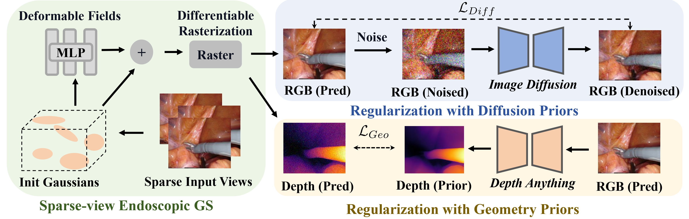

# EndoSparse: Real-Time Sparse View Synthesis of Endoscopic Scenes using Gaussian Splatting

<!-- <i>The avatar is generated by stable diffusion.</i> -->


### [Project Page](https://endo-sparse.github.io/) | [ArXiv Paper](https://arxiv.org/abs/2407.01029)
### Accepted by International Conference on Medical Image Computing and Computer Assisted Intervention (MICCAI 2024)

[Chenxin Li](https://xggnet.github.io/)<sup>1</sup>, 
[Brandon Y. Feng](https://brandonyfeng.github.io/)<sup>2✉</sup>, 
[Yifan Liu](https://yifliu3.github.io/)<sup>1</sup>,
[Hengyu Liu](https://github.com/LiuHengyu321)<sup>1</sup>, 
[Cheng Wang](https://scholar.google.com/citations?user=AM7gvyUAAAAJ&hl=en)<sup>1</sup>,
[Weihao Yu](https://scholar.google.com/citations?user=fCzlLE4AAAAJ&hl=zh-CN&oi=ao)<sup>1</sup>,
[Yixuan Yuan](https://www.ee.cuhk.edu.hk/en-gb/people/academic-staff/professors/prof-yixuan-yuan)<sup>1✉</sup>

<sup>1</sup> The Chinese University of Hong Kong, <sup>2</sup> Massachusetts Institute of Technology

<sup>✉</sup> Corresponding Author. 

-------------------------------------------


## 💡Highlight
- We present state-of-the-art results on surgical scene reconstruction from a sparse set of endoscopic views, achieving and significantly enhancing the practical usage potential of neural reconstruction methods.
- We demonstrate an effective strategy to instill prior knowledge from a pre-trained 2D generative model to improve and regularize the visual reconstruction quality under sparse observations.
- We introduce an effective strategy to distill geometric prior knowledge from a visual foundation model that drastically improves the geometric reconstruction quality under sparse observations.

## 🛠Setup


```bash
git clone https://github.com/CUHK-AIM-Group/EndoSparse.git
cd EndoSparse
conda create -n endosparse python=3.7
conda activate endosparse

pip install -r requirements.txt

pip install -e submodules/depth-diff-gaussian-rasterization
pip install -e submodules/simple-knn
```

**Tips**: 24 GB GPU memory is required for training and inference. 

## 📚Data Preparation
Same to the 📚Data Preparation process of [EndoGaussian](https://github.com/yifliu3/EndoGaussian):

**ENDONERF** The dataset provided in [EndoNeRF](https://arxiv.org/abs/2206.15255) is used. You can download and process the dataset from their [website](https://github.com/med-air/EndoNeRF). We use the two accessible clips including 'pulling_soft_tissues' and 'cutting_tissues_twice'.

**SCARED** The dataset provided in [SCARED](https://endovissub2019-scared.grand-challenge.org/) is used. To obtain a link to the data and code release, sign the challenge rules and email them to max.allan@intusurg.com. You will receive a temporary link to download the data and code. Follow [MICCAI_challenge_preprocess](https://github.com/EikoLoki/MICCAI_challenge_preprocess) to extract data. The resulted file structure is as follows.


The file structure is as follows.
```
├── data
│   | endonerf 
│     ├── pulling
│     ├── cutting 
│   | scared
│     ├── dataset_1
│       ├── keyframe_1
│           ├── data
│       ├── ...
│     ├── dataset_2
|     ├── ...
```


## 🎈Acknowledgements
Greatly appreciate the tremendous effort for the following projects!
- [FSGS](https://github.com/VITA-Group/FSGS)
- [EndoGaussian](https://github.com/yifliu3/EndoGaussian)
- [3D GS](https://github.com/graphdeco-inria/gaussian-splatting)
- [4D GS](https://github.com/hustvl/4DGaussians)
- [EndoNeRF](https://github.com/med-air/EndoNeRF)


## 📜Citation
If you find this work helpful for your project,please consider citing the following paper:
```
@article{li2024endosparse,
  author    = {Chenxin Li and Brandon Y. Feng and Yifan Liu and Hengyu Liu and Cheng Wang and Weihao Yu and Yixuan Yuan},
  title     = {EndoSparse: Real-Time Sparse View Synthesis of Endoscopic Scenes using Gaussian Splatting},
  journal   = {arXiv preprint},
  year      = {2024}
}
```
